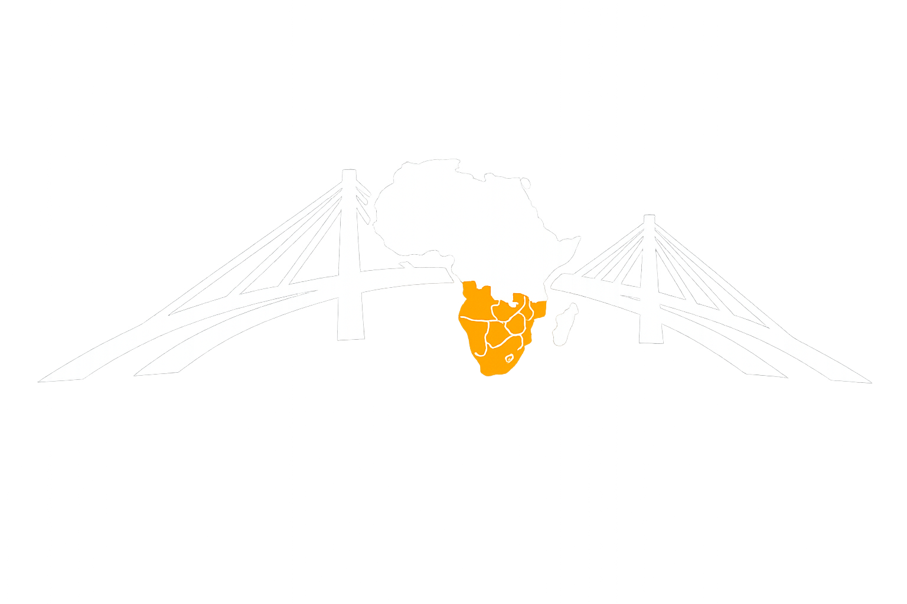

# TradeOps Bridge

<p align="center">
  
</p>

<p align="center">
  <strong>Connecting Italian Agritech Innovation with the Angolan Agricultural Market.</strong>
</p>

---

## About

TradeOps Bridge is an agritech company focused on connecting Italian businesses, investors and technology providers with opportunities in the Angolan agricultural sector.

This repository contains the source code for the company's institutional website, developed as a modern React application.

Although this repository is publicly available as part of my software engineering portfolio, it represents a real company project currently under development.

---

## Objectives

The website aims to:

- Present the company's mission and vision.
- Showcase the services offered by TradeOps Bridge.
- Introduce the team and strategic partners.
- Establish a strong digital presence.
- Serve as the foundation for future digital products and market intelligence services.

---

## Tech Stack

- React
- TypeScript
- Vite
- CSS3
- Lucide React

---

## Project Structure

```text
src/
├── app/
├── components/
│   ├── layout/
│   ├── sections/
│   ├── ui/
│   └── icons/
├── data/
├── hooks/
├── pages/
├── types/
└── utils/
```

---

## Getting Started

Clone the repository

```bash
git clone https://github.com/NicolauAlfredo/tradeops-bridge.git
```

Install dependencies

```bash
npm install
```

Start the development server

```bash
npm run dev
```

Build for production

```bash
npm run build
```

Preview the production build

```bash
npm run preview
```

---

## Roadmap

Current version focuses on the institutional website.

Upcoming features include:

- Responsive improvements
- SEO optimization
- Contact form integration
- CMS integration
- Blog
- Authentication
- Dashboard
- Market intelligence platform
- Agricultural reports
- Interactive maps
- Business portal

---

## Author

**Nicolau Alfredo**

Software Engineer

GitHub: https://github.com/NicolauAlfredo

LinkedIn: https://linkedin.com/in/nicolaualfredo

---

## License

Copyright © TradeOps Bridge.

This repository is published exclusively for portfolio and demonstration purposes.

All visual assets, branding, business concepts, texts, graphics and intellectual property related to TradeOps Bridge remain the exclusive property of TradeOps Bridge.

No part of this project may be copied, redistributed, modified or used commercially without prior written permission from TradeOps Bridge.
